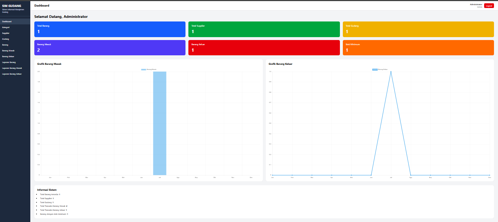
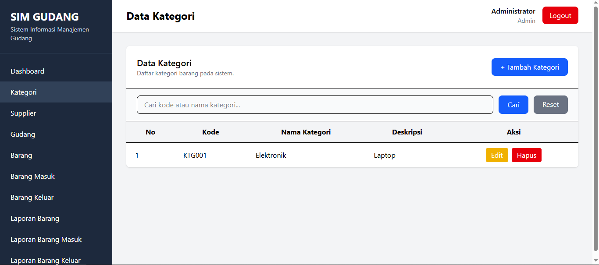
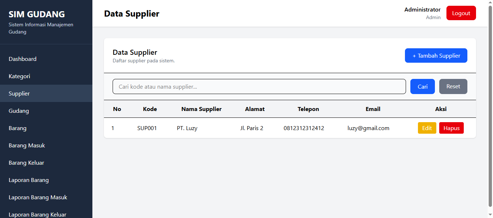
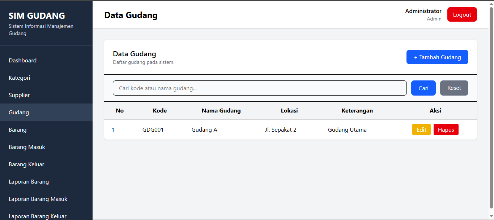
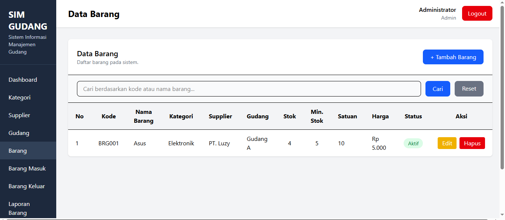
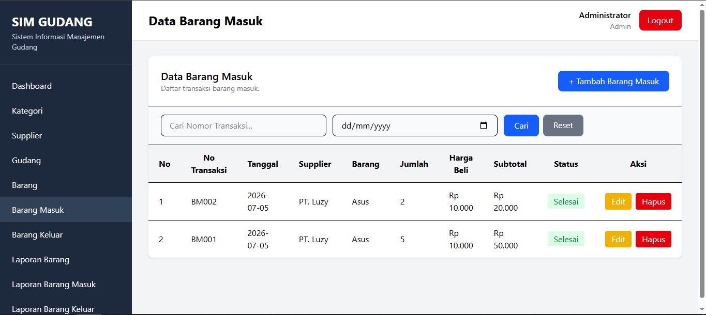

# 📦 Sistem Informasi Gudang

Aplikasi web berbasis **Laravel** yang dirancang untuk membantu pengelolaan data barang di gudang secara efektif dan efisien, mulai dari data master hingga transaksi barang masuk dan barang keluar.


---

# 📖 Deskripsi

Sistem Informasi Gudang merupakan aplikasi berbasis web yang membantu proses pengelolaan stok barang, data kategori, supplier, transaksi barang masuk, transaksi barang keluar, serta pembuatan laporan secara cepat dan akurat.

---

# ✨ Fitur

- 🔐 Login & Autentikasi
- 📊 Dashboard
- 📦 Manajemen Barang
- 🏷️ Manajemen Kategori
- 🏢 Manajemen Supplier
- 📥 Barang Masuk
- 📤 Barang Keluar
- 📄 Laporan Barang
- 🖨️ Cetak Laporan PDF

---

# 🛠️ Teknologi yang Digunakan

| Teknologi | Keterangan |
|-----------|------------|
| Laravel | Framework PHP |
| PHP | Bahasa Pemrograman |
| MySQL | Database |
| Tailwind CSS | Framework CSS |
| Vite | Build Tool |

---

# ⚙️ Instalasi

### Clone Repository

```bash
git clone https://github.com/Vestorb/sim-gudang.git
```

Masuk ke folder project

```bash
cd sim-gudang
```

Install dependency PHP

```bash
composer install
```

Copy file environment

```bash
cp .env.example .env
```

Generate key

```bash
php artisan key:generate
```

Jalankan migrasi database

```bash
php artisan migrate --seed
```

Install dependency frontend

```bash
npm install
```

Compile asset

```bash
npm run dev
```

Jalankan aplikasi

```bash
php artisan serve
```

---

# 📷 Screenshot

Tambahkan screenshot aplikasi di sini.

Contoh:

| Dashboard |
|-----------|
|  |

| Kategori |
|-----------|
|  |

| Supplier |
|-----------|
|  |

| Supplier |
|-----------|
|  |

| Barang |
|---------|--------------|
|  |

| Barang Masuk | Barang Keluar |
|----------------|
|  |  |

---

# 👥 Tim Pengembang

| No | Nama | NIM |
|----|----------------------|-----------|
| 1 | Aristya Novandhika | 251220021 |
| 2 | Moh Luthfi Wardhana | 251220022 |
| 3 | Ferdy Maulana | 251220039 |

---

## 📄 License

Project ini dibuat untuk memenuhi UAS mata kuliah **Sistem Informasi Gudang**.